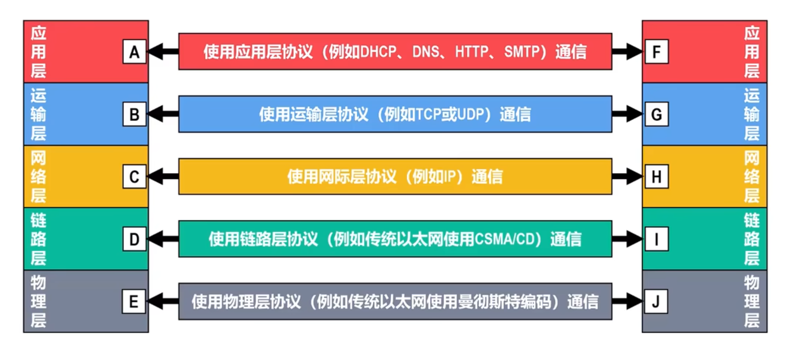
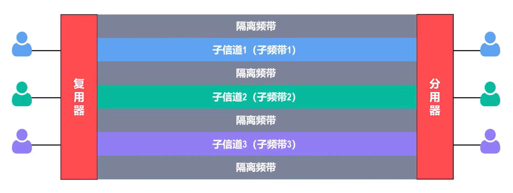

# **一、计算机网络**

## **(1) 信息时代的计算机网络**

## **(2) 因特网概述**

## **(3) 电路交换、分组交换、报文交换**

### **1. 电路交换**
计算机之间的数据传送是突发式的, 当使用电路交换来传送计算机数据时, 其线路的传输效率一般都会很低, 线路上真正用来传送数据的时间往往不到10%甚至1%

### **2. 分组交换**
**发送方** : 构造分组、发送分组
**换节点** : 缓存分组、转发分组
**接收方** : 接受分组、还原报文

**优点 :**
- 没有建立连接和释放连接的过程
- 分组传输过程中逐段占用通信链路,有较高的通信线路利用率
- 交换节点可以为每一个分组独立选择转发路由, 使得网络有很好的生存性

**缺点 :**
- 分组首部带来了额外的传输开销
- 交换节点存储转发分组会造成一定的时延
- 无法确保通信时端到端通信资源全部可用, 在通信量较大时可能造成网络堵塞
- 分组可能会出现失序和丢失等问题

### **3. 报文交换**
- 报文交换是分组交换的前身
- 在报文交换中, 报文被整个地发送, 而不是拆分成若干个分组进行发送
- 交换节点将报文整体接收完成后才能查找转发表, 将整个报文转发到下一个节点
- 因此, 报文交换比分组交换带来的转发时延要长很多, 需要交换节点具有的缓存空间也大很多

### **4. 三种交换的对比**
- 若要连续传送大量的数据, 并且数据传送时间远大于建立连接的时间, 则使用电路交换可以有较高的传输效率. 然而计算机的数据传送往往是突发式的, 采用电路交换时通信线路的利用率会很低
- 报文交换和分组交换都不需要建立连接 (即预先分配通信资源) , 在传送计算机的突发数据时可以提高通信线路的利用率
- 将报文构造成若干个更小的分组进行分组交换, 比将整个报文进行报文交换的时延要小, 并且还可以避免太长的报文长时间占用链路, 有利于差错控制, 同时具有更好的灵活性

## **(4) 计算机网络的定义和分类**
### **定义 :**

- 计算机网络的精确定义并未统一
- 计算机网络的最简单定义 : 一些互连的、自洽的计算机的集合
- 计算机网络主要是由一些通用的、可编程的硬件互联而成的, 而这些硬件并非专门用来实现某一特定目的 (例如, 传送数据或视频信号) . 这些可编程的硬件能够传送多种不同类型的数据, 并能支持广泛的和日益增长的应用

### **分类 :**

- **交换方式 :** 电路交换、报文交换、分组交换
- **使用者    :** 公用网 (因特网)、专用网 (军队、铁路、电力、银行)
- **传输介质 :** 有线网络 (双绞线网络、光纤网络)、无线网络
- **覆盖范围 :** 广域网 (WAN)、城域网 (MAN)、局域网 (LAN)、个域网 (PAN)
- **拓扑结构 :**
    - **总线型 :**
        - 使用单根传输线把计算机连接起来
        - 优点 : 建网容易, 增减节点方便, 节省线路
        - 缺点 : 重负载时通信效率不高, 总线任意一处出现故障则全网瘫痪
    - **星型网络 :**
        - 每个计算机都以单独的线路与中央设备相连. 中央设备早期是计算机, 后来是集线器, 现在一般是交换机或路由器
        - 优点 : 便于网络的集中控制和管理
        - 缺点 : 成本高, 中央设备对故障敏感
    - **环型网络 :**
        - 所有计算机的网络接口都连结成一个环
        - 最典型的例子是令牌环局域网, 环可以是单环, 也可以是双环环中信号是单向传输的
    - **网状型网络 :**
        - 每个节点至少有两条路径与其他节点相连, 多用在广域网中
        - 优点 : 可靠性高
        - 缺点 : 控制复杂, 线路成本高

## **(5) 计算机网络的性能指标**
计算机网络的性能指标被用来从不同方面度量计算机网络的性能
常用的八个计算机网络性能指标 :

### **1.  速率**
- 速率是指数据的传送速率 (即每秒传送多少个比特) , 也称为数据率或比特率
- 速率 = min [主机接口速率, 线路带宽, 交换机或路由器的接口速率]
- 数据量单位中的K、M、G、T的数值分别为$2^{10}$、$2^{20}$、$2^{30}$、$2^{40}$
- 速率 单位中的k、 M、G、T的数值分别为$10^{3}$、$10^{6}$、$10^{9}$、$10^{12}$

  <!-- 左侧表格：数据量的单位 -->
  <table border="1" cellspacing="0" cellpadding="6" style="border-collapse: collapse; text-align: center;">
    <thead>
      <tr>
        <th colspan="2">数据量的单位</th>
      </tr>
      <tr>
        <th>单位</th>
        <th>换算关系</th>
      </tr>
    </thead>
    <tbody>
      <tr>
        <td>比特 (b)</td>
        <td>基本单位</td>
      </tr>
      <tr>
        <td>字节 (B)</td>
        <td>1B = 8bit</td>
      </tr>
      <tr>
        <td>千字节 (KB)</td>
        <td>1KB = 210B</td>
      </tr>
      <tr>
        <td>兆字节 (MB)</td>
        <td>1MB = K·KB = 220B</td>
      </tr>
      <tr>
        <td>吉字节 (GB)</td>
        <td>1GB = K·MB = 230B</td>
      </tr>
      <tr>
        <td>太字节 (TB)</td>
        <td>1TB = K·GB = 240B</td>
      </tr>
    </tbody>
  </table>

  <!-- 右侧表格：速率的单位 -->
  <table border="1" cellspacing="0" cellpadding="6" style="border-collapse: collapse; text-align: center;">
    <thead>
      <tr>
        <th colspan="2">速率的单位</th>
      </tr>
      <tr>
        <th>单位</th>
        <th>换算关系</th>
      </tr>
    </thead>
    <tbody>
      <tr>
        <td>比特/秒 (b/s)</td>
        <td>基本单位</td>
      </tr>
      <tr>
        <td>b/s 可记为 bps</td>
        <td></td>
      </tr>
      <tr>
        <td>千比特/秒 (kb/s)</td>
        <td>1kb/s = 103b/s</td>
      </tr>
      <tr>
        <td>兆比特/秒 (Mb/s)</td>
        <td>1Mb/s = k·kb/s = 106b/s</td>
      </tr>
      <tr>
        <td>吉比特/秒 (Gb/s)</td>
        <td>1Gb/s = k·Mb/s = 109b/s</td>
      </tr>
      <tr>
        <td>太比特/秒 (Tb/s)</td>
        <td>1Tb/s = k·Gb/s = 1012b/s</td>
      </tr>
    </tbody>
  </table>

### **2. 带宽**
- 线路的频率带宽越宽, 其传输的最高数据率也越高
- 带宽在模拟信号系统中的意义 :
	- 某个信号所包含的各种不同频率成分所占据的频率范围
	- 单位 : Hz (kHz, MHz, GHz)
- 带宽在计算机网络中的意义 :
	- 用来表示网络的通信线路所能传送数据的能力, 即在单位时间内从网络中的某一点到另一点所能通过的最高数据率
	- 单位 : b/s (kb/s, Mb/s, Gb/s, Tb/s)
    
### **3. 吞吐量**
- 吞吐量是指在单位时间内通过某个网络或接口的实际数据量. 吞吐量常被用于对实际网络的测量, 以便获知到底有多少数据量通过了网络
- 吞吐量受网络带宽的限制
    
### **4. 时延**
- 时延是指数据从网络的一端传送到另一端所耗费的时间, 也成为延迟或迟延. 数据可由一个或多个分组、甚至是一个比特构成
- 假设各分组等长, 各链路等长, 主机和路由器的发送速率相等, 在不考虑排队时延和处理时延的情况下, 源主机通过n个路由器的转发, 给目的主机发送m个分组的总延时计算公式 : $$ T = (m + n)\frac{L}{R} + (n + 1)\frac{d}{s} $$
    - 各参数含义:
        - L：每个分组的长度（b）
        - R：链路带宽（bps）
        - m：分组数量
        - n：中间路由器数量（跳数 = n+1）
        - d：每段链路的物理长度（m）
        - s：信号在介质中的传播速率（m/s）
        
        
### **5. 时延带宽积**
- 时延带宽积是传播时延和带宽的乘积
- 链路的时延带宽积也称为以比特为单位的链路长度

### **6. 往返时间**
- 往返时间 (RTT) 是指从发送端发送数据分组开始, 到发送端收到接收端发来的相应确认分组为止, 总共耗费的时间

### **7. 利用率**
- 路利用率 :
	- 链路利用率是指某条链路有百分之几的时间是被利用的 (即有数据通过),
	- 完全空闲的链路的利用率为零
- 网络利用率 :
	- 网络利用率是指网络中所有链路的链路利用率的加权平均
- 根据排队论可知, 当某链路的利用率增大时, 该链路引起的时延就会迅速增加
- 当网络的通信量较少时, 产生的时延并不大, 但在网络通信量不断增大时, 分组在交换节点(路由器或交换机) 中的排队时延会随之增大, 因此网络引起的时延就会增大
 - 令$D_0$表示网络空闲时的时延, D表示网络当前的时延, 那么在理想的假定条件下, 可用下式来表示D、$D_0$和网络利用率U之间的关系 :$$ D = \frac{D_0}{1 - U} $$
	    
    
### 8. 丢包率

- 丢包率是指在一定的时间范围内, 传输过程中丢失的分组数量与总分组数量的比率
- 分组丢失主要有以下两种情况 :
    - 分组在传输过程中出现误码, 被传输路径中的节点交换机 (例如路由器) 或目的主机检测出误码而丢弃
    - 节点交换机根据丢弃策略主动丢弃分组
- 丢包率可以反应网络的拥塞情况 :
    - 无拥塞时路径丢包率为0
    - 轻度拥塞时路径丢包率为1%~4%
    - 严重拥塞时路径丢包率为5%~15%

## **(6) 计算机网络体系结构**
### **1. 常见的三种计算机网络体系结构**

### **2. 计算机网络体系结构分层的必要性**
- 计算机网络是个非常复杂的系统
- “分层”可将庞大复杂的问题转化为若干个较小的局部问题 :
	- **物理层 :**
	    - 采用什么传输媒体 (物理层之下)
	    - 采用什么物理接口
	    - 采用什么信号, 如比特0和1
	
	- **数据链路层 :**
	    - 标识网络中各主机 (主机编址, 例如MAC地址)
	    - 从比特流中区分出地址和数据 (数据封装格式)
	    - 协调各主机争用总线 ((流量控制)
	    - 以太网交换机的实现 ((流量控制)
	    - 检测数据是否误码 ((流量控制)
	    - 出现传输差错如何处理 ((流量控制)
	    - 接收方控制发送方注入网络的数据量 (流量控制)
	
	- **网络层 (又称网际层) :**
	    - 标识网络和网络中的各主机 (网络和主机共同编址, 例如IP地址)
	    - 路由器转发分组 (路由选择协议, 路由表和转发表)
	
	- **运输层 :**
	    - 进程之间基于网络的通信 (进程的标识, 例如端口号)
	    - 出现传输差错如何处理 (可靠传输和不可靠传输)
	
	- **应用层 :**
	    - 通过应用进程间的交互来完成特定 的网络应用
	    - 进行绘画管理和数据表示

### **3. 计算机网络体系结构分层思想举例**

### **4. 计算机网络体系结构中的专业术语**
#### **实体**
- 实体是指任何可发送或接收信息的硬件或软件进程
- 对等实体是指通信双方相同层次中的实体

	
#### **协议**
- 协议是控制两个对等实体在"水平方向"进行"逻辑通信"的规则的集合

- 协议的三要素 :
	- 语法 : 定义所交换信息的格式
	- 语义 : 定义通信双方所要完成的操作
	- 同步(时序) : 定义通信双方的时序关系

#### **服务**
- 在协议的控制下,  两个对等实体在水平方向的逻辑通信使得本层能够向上一层提供服务
	- 要实现本层协议, 还需要使用下面一层所提供的服务
	- 协议是"水平"的, 而服务是"垂直"的
	- 实体看得见下层提供的服务, 但并不知道实现该服务的具体协议. 下层的协议对上层的实体是"透明"的
- 在同一系统中相邻两层的实体交换信息的逻辑接口称为服务访问点SAP, 它被用于区分不同的服务类型
- 帧的"类型"字段、IP数据报的"协议"字段, TCP报文段或UDP用户数据报的"端口号"字段都是SAP
- 上层要使用下层所提供的服务, 必须通过与下层交换一些命令, 这些命令称为服务原语
- 对等层次之间传送的数据包称为该层的协议数据单元 (PDU)
- 同一系统内层与层之间交换的数据包称为服务数据单元 (SDU)

# **二、物理层**
## **(1) 物理层概述**
### **物理层要实现的功能**

### **物理层接口特性**
#### **机械特性**
- 形状和尺寸
- 引脚数目和排列
- 固定和锁定装置

#### **电气特性**
- 信号电压的范围
- 阻抗匹配的情况
- 传输速率
- 距离限制

#### **功能特性**
- 规定接口电缆的各条信号线的作用

#### **过程特性**
- 规定在信号线上传输比特流的一组操作过程, 包括各信号间的时序关系

## **(2) 物理层下面的传输媒体**
#### **传输媒体的分类**
- 传输媒体是计算机网络设备之间的物理通路, 也称为传输介质或传输媒介
- 传输媒体并不包含在计算机网络体系结构中

#### **导向型传输媒体**
##### **同轴电缆**

##### **双绞线**

##### **光纤**
- 光纤通信利用光脉冲在光纤中的传递来进行通信. 由于可见光的频率非常高 (约为$10^{8}$MHz量级), 因此一个光纤通信系统的传输带宽远大于目前其他各种传输媒体的带宽

#### **非导向型传输媒体**

##### **无线电波**

##### **微波**

##### **红外线**

##### **激光**

##### **可见光**

## **(3) 传输方式**
### **串行传输和并行传输**

### **同步传输和异步传输**
- 同步传输
	
- 异步传输
	

### **单向通信、双向交替通信和双向同时通信**

## **(4) 编码与调制**
### **编码与调制的基本概念**

### **常用编码方式**

### **基本的带通调制方法和混合调制方法**
- 基本的带通调制方法
	

- 混合调制方法
	
	
	
	
## **(5) 信道的极限容量**
### **造成信号失真的主要因素**

- 信道上传输的数字信号, 可以看作是多个频率的模拟信号进行多次叠加后形成的方波
- 如果数字信号中的高频分量在传输时收到衰减甚至不能通过信道, 则接收端接收到的波形前沿和后沿就变得不那么陡峭, 每一个码元所占的时间界限也不再明确. 这样, 在接收端收到的信号波形就失去了码元之间的清晰界限, 这种现象称为码间串扰
- 如果信道的频带越宽, 则能够通过的信号的高频分量就越多, 那么码元的传输速率就可以更高, 而不会导致码间串扰
- 然而, 信道的频率带宽是由上限的, 不可能无限大. 因此, 码元的传输速率也有上限

### **奈氏准则**
- 理想低通信道的最高码元传输速率 = 2W Baud = 2W 码元/秒
	- W : 信道的频率带宽 (单位为Hz)
	- Baud : 波特, 即码元/秒
- 使用奈氏准则给出的公式, 就可以根据信道的频率带宽, 计算出信道的最高码元传输速率
- 只要码元传输速率不超过根据奈式准则计算出的上线, 就可以避免码间串扰
- 奈氏准则给出的时理想低通信道的最高码元传输速率, 它和实际信道有较大的差别. 因此, 一个实际的信道所能传输的最高码元传输速率, 要明显低于奈氏准则给出的上限值
- 码元传输速率又称为波特率、调制速率、波形速率或符号速率
- 波特率与比特率有一定的关系 :
	- 当一个码元只携带1比特的信息量时, 波特率 (码元/秒) 与比特率 (比特/秒) 在数值上是相等的
	- 当一个码元携带n比特的信息量时, 波特率 (码元/秒) 转换成比特率 (比特/秒) 时, 数值要乘以n

### **香农公式**
- 带宽受限且有高斯白噪声干扰的信道的极限信息传输速率
- $$
C = W \log_2 \left( 1 + \frac{S}{N} \right)
$$
	- C : 信道的极限信息传输速率 (b/s)
	- W : 信道的频率带宽 (Hz)
	-  S : 信道内所传信号的平均功率
	- N : 信道内的高斯噪声功率
	- S/N : 信噪比, 常用分贝 (dB)表示    信噪比 (db) = $10\log_2 \left( 1 + \frac{S}{N} \right)$

- 信道的频率带宽W或信道中的信噪比S/N越大, 信道的极限信息传输速率C就越高
- 实际信道不可能无限制地提高频率带宽W或信道中的信噪比S/N
- 实际信道中能够达到的信息传输速率, 要比香农公式给出的极限传输速率低不少, 这是因为在实际信道中, 信号还要受到其他一些损伤, 例如各种脉冲干扰和信号衰减等, 这些因素在香农公式中并未考虑
---
- 在信道的频率带宽W一定的情况下, 根据奈氏准则和香农公式, 要想提高信息的传输速率, 就必须采用多元制 (更复杂的调制技术), 并努力提高信道中的信噪比
- 自从香农公式发表后, 各种新的信号处理和调制方法就不断出现, 其目的都是为了使码元可以携带更多个比特, 进而可以尽可能地接近香农公式给地传输速率极限

## **(6) 信道复用技术**
### **信道复用技术地基本原理**
- 复用就是在一条传输媒体上同时传输多路用户的信号
- 当一条传输媒体地传输容量大于多条信道传输地总容量时, 就可以通过复用技术, 在这条传输媒体上建立多条通信信道, 以便充分利用传输媒体的带宽
- 尽管实现信道复用会增加通信成本 (需要复用器、分用器以及费用较高地大容量共享信道) , 但如果复用的信道数量较大, 还是比较划算的

### **常见地信道复用技术**
#### **频分复用FDM**
- 频分复用的所有用户同时占用不同的频带资源发送数据

#### **时用复用TDM**
- 时分复用的所有用户在不同的时间占用同样的频率

#### **波分复用WDM**
- 根据频分复用的设计思想, 可在一根光线上同时传输多个频率 (波长) 相近的光载波信号, 实现基于光纤的频分复用技术
- 目前可以在一根光线上复用80路或更多路的光载波信号. 因此, 这种复用技术也称为密集波分复用DWDM
- 铺设光缆 的工程耗资巨大, 应尽量在一根光缆中放入尽可能多的光纤, 然后对每一根光纤使用密集波分复用技术

#### **码分复用CDM**
- 码分复用常称为码分多址 (CDMA) , 它是在扩频通信技术的基础上发展起来的一种无线通信技术
- 与FDM和TDM不同, CDMA的每个用户可以在相同的时间使用相同的频带进行通信
- CDMA最初用于军事通信,  这种系统发送的信号有很强的抗干扰能力, 其频谱类似于白噪声, 不易被敌人发现
- 随着技术的进步, CDMA设备的价格和体积都大幅度下降, 因而现在已广泛用于民用的移动通信中
- CDMA将每个比特时间划分为m个更短的时间片, 称为码片
- CDMA中的每个站点都被指派一个唯一的m比特码片序列
	- 某个站要发送比特1, 则发送它自己的m比特码片序列
	- 某个站要发送比特0, 则发送它自己的m比特码片序列的反码
	- 假设m为8
		
- 如果有两个或多个站同时发送数据, 则信道中的信号就是这些站各自所发送一系列码片序列或码片序列反码的叠加. 为了从信道中分离出每个站的信号, 给每个站指派码片序列时, 必须遵循以下规则 :
	- 分配给每个站的码片序列必须各不相同, 实际常采用伪随机码序列
	- 分配给每个站的码片序列必须相互正交, 即各码片序列相应的码片向量之间的规格化内积为0
	
	
	
		
		
		

# **三、数据链路层**

# **四、网络层**
## **(1) 网络层概述**

- 分组转发和路由选择 :
	- 网络层的主要任务就是将分组从源主机经过多个网络和多段链路传输到目的主机, 可以将该任务划分为分组转发和路由选择两种重要功能
- 网络层向其上层提供的两种服务 :	

<table>
  <thead>
    <tr>
      <th style="width:85px; text-align:center;">对比方面</th>
      <th style="text-align:center;">虚电路服务</th>
      <th style="text-align:center;">数据报服务</th>
    </tr>
  </thead>
  <tbody>
    <tr>
      <td style="text-align:center;">核心思想</td>
      <td>可靠通信应由网络自身来保证</td>
      <td>可靠通信应由用户主机来保证</td>
    </tr>
    <tr>
      <td style="text-align:center;">连接</td>
      <td>必须建立网络层连接(虚电路)</td>
      <td>不需要建立网络层连接</td>
    </tr>
    <tr>
      <td style="text-align:center;">目的地址</td>
      <td>仅在连接建立阶段使用, 之后每个分组使用短的虚电路号</td>
      <td>每个分组都必须携带完整的目的地址</td>
    </tr>
    <tr>
      <td style="text-align:center;">分组转发</td>
      <td>属于同一条虚电路的分组均按同一路由进行转发</td>
      <td>每个分组可走不同的路由</td>
    </tr>
    <tr>
      <td style="text-align:center;">节点故障</td>
      <td>所有通过出故障的节点的虚电路均不能工作</td>
      <td>出故障的节点可能会丢失分组, 一些路由可能会发生变化</td>
    </tr>
    <tr>
      <td style="text-align:center;">分组顺序</td>
      <td>总是按发送顺序到达目的主机</td>
      <td>到达目的主机时不一定按发送顺序</td>
    </tr>
    <tr>
      <td style="text-align:center;">服务质量</td>
      <td>可以将通信资源提前分配给每一个虚电路, 因此容易实现</td>
      <td>很难实现</td>
    </tr>
  </tbody>
</table>

## **(2) 网际协议IP**

- 网际协议 (Internet Protocol, IP) 是TCP/IP体系结构网际层中的核心协议
- 网际协议IP、传输控制协议TCP、TCP/IP体系结构是由"因特网之父"Robert Kahn和Vint Cerf二人共同研发的, 1974年5月发布了TCP/IP的第一个版本

### **1. 异构网络互连**

- 这些网络的拓扑、性能以及所使用的网络协议都不尽相同, 这是由用户需求的多样性造成的, 没有一种单一的网络能够适应所有用户的需求
- 要将众多的异构型网络都互连起来, 并且能够互相通信, 则会面临许多需要解决的问题 :
	- 不同的网络接入机制
	- 不同的差错恢复方法
	- 不同的路由选择技术
	- 不同的寻址方案
	- 不同的最大分组长度
	- 不同的服务 (面向连接服务和无连接服务)

### **2. IPv4地址及其编址方法**
#### **IPv4地址概述**
- IPv4地址是给因特网上的每一个主机 (或路由器) 的每一个接口分配的一个在全世界范围内唯一的32比特的标识符
- IPv4地址由因特网名字和数字分配机构 (ICANN) 进行分配
	- 我国用户可向亚太网络信息中心 (APNIC) 申请IP地址, 需要缴纳相应的费用, 一般不接受个人申请
	- 2011.02.03, 因特网号码非陪管理局 (IANA)  宣布, IPv4地址已经分配完毕
	- 我国在2014年至2015年也逐步停止了向新用户和应用分配IPv4地址,同时全面开展商用部署IPv6
- IPv4地址的编址方法 经历了三个历史阶段 :
	

#### **IPv4地址的表示方法**
- 由于IPv4地址由32比特构成, 不方便阅读、记录以及输入等, 因此IPv4地址采用点分十进制表示方法以方便用户使用

####  **IPv4地址的分类编址方法**

- A类, B类和C类地址都是单播地址, 只有单播地址可以分配给网络中的主机 (或路由器) 的各接口
- 主机号为"全0"的地址都是网络地址, 不能分配给主机 (或路由器) 的个接口
- 主机号为"全1"的地址都是广播地址, 不能分配给主机 (或路由器) 的个接口

| 网络类别 | 最小可指派网络号 |  最大可指派网络号   |    可指派网络数量    | 每个网络中最大可分配地址数量 | 不能指派的网络号 |       占总地址空间        |
| :--: | :------: | :---------: | :-----------: | :------------: | :------: | :-----------------: |
|  A   |    1     |     126     |      126      |    16777214    |  0和127   |         50%         |
|      |          |             | ($2^{8-1}-2$) |  ($2^{24}-2$)  |          | ($2^{32-1}/2^{32}$) |
|  B   |  128.0   |   191.255   |     16384     |     65534      |    /     |         25%         |
|      |          |             | ($2^{16-2}$)  |  ($2^{16-2}$)  |          | ($2^{32-2}/2^{32}$) |
|  C   | 192.0.0  | 223.255.255 |    2097152    |      254       |    /     |        12.5%        |
|      |          |             | ($2^{24-3}$)  |  ($2^{8}-2$)   |          | ($2^{32-3}/2^{32}$) |
	
	
	
####  **IPv4地址的划分子网编址方法**
- 随着更多的中小网络加入因特网, IPv4分类编址方法不够灵活、容易造成大量IPv4地址资源浪费的缺点就暴露出来了
- 为新增网络申请新的网络号存在以下弊端
	- 需要等待时间和花费更多的费用
	- 会增加其他路由器中路由条目的数量
	- 浪费原有网络号中剩余的大量地址
- 子网掩码可以表明分类IPv4地址的主机号部分被借用了几个比特作为子网号
- 与IPv4地址类似, 子网掩码也是由32比特构成的
	- 用左起多个连续的比特1对应IPv4地址中的网络号和子网号
	- 之后的多个连续的比特0对应IPv4地址中的主机号
- 将划分子网的IPv4地址与相应的子网掩码进行逐比特的逻辑与运算, 就可得到该IPv4地址所在子网的网络地址
- 给定一个分类的IPv4地址和其相应的子网掩码, 就可得出子网划分的细节 :
	- 划分出的子网数量
	- 每个子网可分配的地址数量
	- 每个子网的网络地址和广播地址
	- 每个子网可分配的最小地址和最大地址
- 默认子网掩码是指在未划分子网的情况下使用的子网掩码 :
	- A类 : 255.0.0.0
	- B类 : 255.255.0.0
	- C类 : 255.255.255.0

#### **IPv4地址的无分类编址方法**
- IPv4地址的划分子网编址方法在一定程度上缓解了因特网在发展中遇到的困难, 但是数量巨大的C类网 ($2^{24-3} = 2097152$) 由于其每个网络所包含的地址数量太小 ($2^{8} = 256$) , 因此并没有得到充分使用, 而因特网的IPv4地址仍在加速消耗, 整个IPv4地址空间面临全部耗尽的威胁
- 为此, 因特网工程任务组IETF又提出了采用无分类编址的方法, 来解决IPv4地址资源紧张的问题, 同时还专门成立IPv6工作组负责研究新版的IP, 以彻底解决IPv4地址耗尽问题
- 1993年, 因特网工程任务组IETF发布了无分类域间路由选择 (CIDR) 的RCF文档
	- CIDR消除了传统A类, B类和C类地址以及划分子网的概念
	- CIDR可以更加有效地分配IPv4地址资源, 并且可以在IPv6使用之前允许因特网的规模继续增长

- 无分类编址方法使用的地址掩码与划分子网使用的子网掩码类似, 由32比特构成
	- 用左起多个连续的比特1对应IPv4地址中的网络前缀
	- 之后的多个连续的比特0对应IPv4地址中的主机号
- 为了简便起见, 可以不明确给出配套的地址掩码的点分十进制形式, 而在无分类编址的IPv4后面加上"/", 在斜线之后写上网络前缀所占的比特数量 (也就是地址掩码中左起连续比特1的数量) , 这种记法称为斜线记法
- 实际上, 无分类域间路由选择CIDR是将网络前缀都相同的、连续的多个无分类IPv4地址, 组成一个CIDR地址块, 只要知道CIDR地址块中的任何一个地址, 就可以知道该地址块的以下全部细节 :
	- 地址块中的最小地址
	- 地址块中的最大地址
	- 地址块中的地址数量
	- 地址块中聚合某类网络 (A类, B类, C类) 的数量
	- 地址掩码
- 使用CIDR的一个好处是, 可以根据客户的需要分配适当大小的CIDR地址块, 因此可以更加有效地分配IPv4的地址空间
- 网络前缀越长, 地址块越小, 路由越具体
- 若路由器查表转发分组时发现有多条路由条目匹配, 则选择网络前缀最长的那条路由条目, 这称为最长前缀匹配, 因为这样的路由更具体

### **3. IPv4地址的应用规划**

### **4. IPv4地址与MAC地址**
#### **IPv4地址与MAC地址的封装位置**

#### **数据包传送过程中IPv4地址与MAC地址的变化情况**
- 在数据包的传送过程中, 数据包的源IP地址和目的IP地址保持不变
- 在数据包的传送过程中, 数据包的源MAC地址和目的MAC地址逐链路 (或逐网络) 改变

#### **IPv4地址与MAC地址的关系**
- 如果仅使用MAC地址进行通信, 则会出现以下主要问题 :
	- 因特网中的每台路由器的路由表中就必须记录因特网上所有主机和路由器各接口的MAC地址
	- 手工给个路由器配置路由表几乎是不可能完成的任务, 即使使用路由协议让路由器通过相互 交换路由信息来自动构建路由表, 也会因为路由信息需要包含海量的MAC地址信息而严重占用通信资源
	- 包含海量MAC地址的路由信息需要路由器具备极大的存储空间, 并且会给分组的查表转发带来非常大的时延
- 因特网的网际层使用IP地址进行寻址, 就可使因特网中各路由器的路由表中的路有记录的数量大大减少, 因为只需记录部分网络的网络地址, 而不是记录每个网络中各通信设备的各接口的MAC地址
	- 路由器收到IP数据报后, 根据其首部中的目的IP地址的网络号部分, 基于自己的路由表进行查表转发
	- 查表转发的结果可以指明IP数据报的下一跳路由器的IP地址, 但无法指明该IP地址所对应的MAC地址. 因此, 在数据链路层封装该IP数据报成为帧时, 帧首部中的MAC地址字段就无法填写, 该问题需要使用网际层中的地址解析协议ARP来解决
### **5. 地址解析协议ARP**
ARP协议的相关注意事项 :
	- 由于ARP协议的主要用途是从网际层使用的IP地址解析出在数据链路层使用的MAC地址. 因此, ARP协议既可以划归在网际层, 也可以划归在数据链路层
	- ARP除了有请求报文和响应报文, ARP协议还有其他类型的报文, 例如用于检查IP地址冲突的"无故ARP"
	- 由于ARP协议很早就定制出来了 (1982年11月) , 当时并没有考虑到网络安全问题. 因此, ARP协议没有安全验证机制, 存在ARP欺骗和攻击等问题
### **6. IP数据报的发送和转发流程**
- 主机发送IP数据报
	- 判断目的主机是否与自己在同一个网络
		- 若在同一个网络, 则属于直接交付
		- 若不在同一个网络, 则属于间接交付. 发送给主机所在网络的默认网关 (路由器) , 由默认网关帮忙转发
- 路由器转发IP数据报
	路由器收到某个正确的IP数据报 (首部各字段合法且传输过程中无误码) , 应该如何转发
	- 基于IP数据报首部中的目的IP地址在路由表中进行查询
		- 若找到匹配的路由条目, 则按该路由条目的指示进行转发
		- 否则丢弃该IP数据报, 并向发送该IP数据报的源主机发送差错报告
	
### **7. IPv4数据报的首部格式**
- IPv4数据报的首部格式及其内容是实现IPv4协议各种功能的基础
- 在TCP/IP标准中, 各种数据格式常常以32比特 (即4字节) 为单位来描述
- 固定部分是指每个IPv4数据报都必须要包含的部分
- 某些IPv4数据报的首部, 除了包含20字节的固定部分, 还包含一些可选的字段来增加IPv4数据报的功能
- IPv4数据报首部中的各字段或某些字段的组合, 用来表达IPv4协议的相关功能

#### **版本 :**
- 长度为4个比特, 用来表示IP协议的版本
- 通信双方使用的IP协议版本必须一致. 目前广泛使用的IP协议的版本号为4 (即IPv4)

#### **首部长度 :**
- 长度为4个比特, 该字段的取值以4字节为单位, 用来表示IPv4数据报的首部长度
- 最小取值为二进制的0101, 即十进制的5, 再乘以4字节单位, 表示IPv4数据报首部只有20字节固定部分
- 最大取值为二进制的1111, 即十进制的15, 再乘以4字节单位, 表示IPv4数据报首部包含20字节固定部分和最大40字节可变部分

#### **可选字段 :**
- 长度从1字节到40字节不等, 用来支持排错、测量以及安全措施等功能
-  虽然可选字段增加了IPv4数据报的功能, 但这同时也使得IPv4数据报的首部长度成为可变的, 这就增加了因特网中每一个路由器处理IPv4数据报的开销
- 实际上, 可选字段很少被使用

#### **填充 :**
- 用来确保IPv4数据报的首部长度是4字节的证整数倍, 使用全0进行填充

#### **区分服务 :**
- 长度为8个比特 , 用来获得更好的服务
- 该字段在旧标准中叫作服务类型, 但实际上一直没有被使用过
- 1998年, 因特网工程任务组IETF把这个字段改名为区分服务
- 利用该字段的不同取值可提供不同等级的服务质量
- 只有在使用区分服务时该字段才起作用, 一般情况下都不使用该字段

#### **总长度 :**
- 长度为16个比特, 该字段的取值以字节为单位, 用来表示IPv4数据报的长度 (首部长度+数据载荷长度)
- 最大取值为二进制的16个比特1, 即十进制的655335 (很少传输这么长的IPv4数据报) 
---
 
共同用于IPv4数据报分片

#### **标识 :**
- 长度为16个比特, 属于同一个IPv4数据报的各分片数据报应该具有相同的标识
- IP软件会维持一个计数器, 每产生一个IPv4数据报, 计数器值就+1, 并将此值赋给标识字段

#### **标志  :**
- 最低位 (MF)
	- MF=1表示本分片后面还有分片
	- MF=0表示本分片后面没有分片
- 中间位 (DF)
	- DF=1表示不允许分片
	- DF=0表示允许分片
- 最高位为保留位, 必须设置为0

#### **片偏移 :**
- 长度为13个比特, 该字段的取值以8字节为单位, 用来指出分片IPv4数据报的数据载荷偏移其在原IPv4数据报的位置有多远

---
#### **生存时间 (TLL) :**
- 长度为8个比特,其最大值为二进制的11111111, 即十进制的255. 该字段的取值最初以秒为单位. 因此, IPv4数据报的最大生存时间为255s. 路由器转发IPv4数据报时, 将其首部中该字段的值减去该数据报在路由器上所耗费的时间, 若结果不为0就转发, 否则就丢弃
- 生存时间字段后来改为以"跳帧"为单位, 路由器收到待转发的IPv4数据报时, 将其首部中的该字段的值-1, 若结果不为0就转发, 否则就丢弃
- 生存时间字段的作用 : 防止被错误路由的IPv4数据报无限制地在因特网中兜圈

####  **协议 :**
- 长度为8个比特, 用来指明IPv4数据报的数据载荷是何种协议数据单元PDU
	
	
#### **首部检验和 :**
- 长度为16个比特, 用于检测IPv4数据报在传输过程中其首部是否出现了差错
- IPv4数据报每经过一个路由器, 其首部中的某些字段的值 (例如生存时间TTL、标志以及片偏移等) 都可能发生变化, 因此路由器都要重新计算一下首部检验和

- 两个数进行二进制反码求和的运算规则是从低位到高位逐列进行计算 :
	- 0和0相加是0
	- 0和1相加是1
	- 1和1相加是0, 但要产生一个进位1, 加到下一列
	- 若最高位相加后产生进位, 则最后得到的结果要加1
- 由于网际层并不向其高层提供可靠传输的服务, 并且计算首部检验和是一项耗时的操作, 因此在IPv6中,路由器不再计算首部检验和, 从而更快转发IP数据报

#### **源IP地址**
- 长度为32个比特, 用来填写发送IPv4数据报的源主机的IPv4地址

#### **目的IP地址**
- 长度为32个比特, 用来填写接受IPv4数据报的目的主机的IPv4地址
## **(3) 静态路由配置**
## **(4) 因特网的路由选择协议概述**

# **五、运输层**
## (1) 运输层概述
### **进程间基于网络的通信**
- 物理层、数据链路层和网络层, 它们共同解决了将主机通过异构网络互联起来所面临的问题, 实现了主机到主机的通信
- 然而在计算机网络中实际进行通信的真正实体, 是位于通信两端主机中的进程
- 运输层的主要任务 : 为运行在不同主机上的应用进程提供直接逻辑通信服务. 运输层协议又称为端到端协议

### **TCP/IP运输层中的两个重要协议**

### **运输层端口号 :**
- 运行在计算机上的进程是使用进程标识符 (PID) 来标识的
	- 然而, 因特网上的计算机并不是使用统一的操作系统, 而不同操作系统又使用不同格式的进程标识符
	- 为了使运行不同操作系统的计算机的应用进程 之间能够基于网络进行通信, 就必须使用统一的方法对TCP/IP体系的应用进程进行标识
- TCP/IP体系结构的运输层使用端口号来标识 和区分应用层的不同应用进程. 端口号的长度为16比特, 取值范围是0~65535

### **发送方的复用和接收方的分用**

## **(2) UDP和TCP的对比**

### **无连接的UDP和面向连接的TCP** -- "连接"指逻辑连接关系, 而不是物理连接

### **UDP和TCP对单播、多播和广播的支持情况**

### **UDP和TCP对应用层报文的处理**

### **UDP和TCP对数据传输可靠性的支持情况**

### **UDP和TCP首部的对比**

### **总结**

| 
UDP
          | 
TCP
         |
| ----------------------------- | ---------------------------- |
| 无连接                           | 面向连接                         |
| 支持"一对一"、"一对多"、"多对一"和"多对多"交互通信 | 每一条 TCP连接只能有两个端点EP, 只能是一对一通信 |
| 面向应用报文                        | 面向字节流                        |
| 尽最大努力交付, 即不可靠; 不使用流量控制和拥塞控制   | 可靠传输, 使用流量控制和拥塞控制            |
| 首部开销小, 仅8字节                   | 首部最小20字节 , 最大60字节            |

## **(3) TCP**
### **TCP报文段的首部格式**

#### **源端口和目的端口**
[[计算机网络#**运输层端口号 **)]

#### **TCP实现可靠传输的相关字段**
##### **序号**
- 占32比特, 取值范围$0$~$2^{32}-1$. 当序号增加到最后一个时, 下一个序号又回到0. 用来指出本TCP报文段数据载荷的第一个字节的序号
##### **确认号**
- 占32比特, 取值范围$0$~$2^{32}-1$. 当确认号增加到最后一个时, 下一个确认号又回到0. 用来指出期望收到对方下一个TCP报文段的数据载荷的第一个字节的序号, 同时也是对之前收到的所有数据的确认
##### **确认标志位ACK**
- 只有当ACK取值为1时, 确认号字段才有效
- ACK取值为0时, 确认号字段无效
- TCP规定 : 在TCP连接建立后, 所有传送的TCP报文段都必须把ACK置1

# **六、应用层**
# **七、网络安全**

