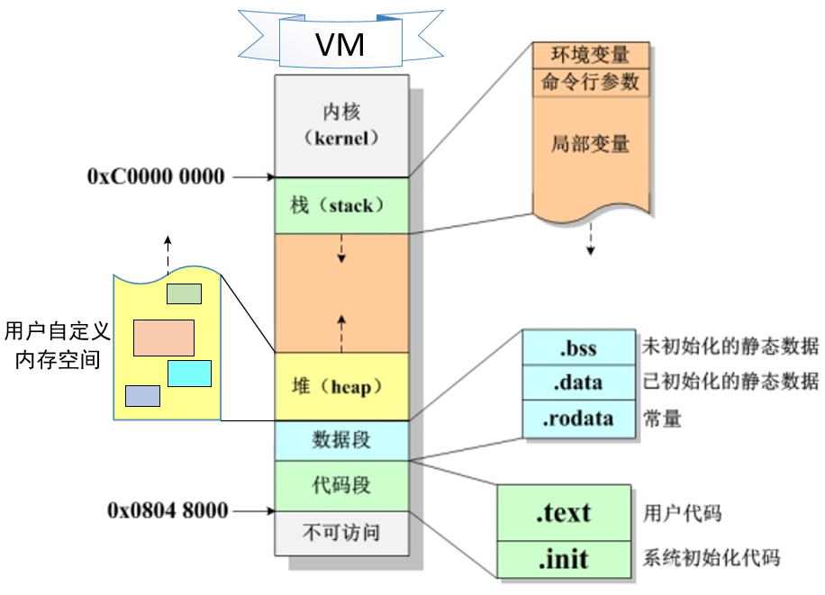

# **C语言**

## **必问**

### **局部变量能否和全局变量重名**
能, 局部会屏蔽全局
...

### **数组的特点**
- **长度固定**
- **存储相同类型**
- **连续内存存储**
- **下标访问**
- **缺乏越界检查**

### **内存访问越界**
- **读越界**
	- 程序从一个<font color="#ff0000">分配的内存区域之外</font>的地址<font color="#00b0f0">读取</font>数据
- **写越界**
	- 程序向一个<font color="#ff0000">分配的内存区域之外</font>的地址<font color="#00b0f0">写入</font>数据

### **什么是内存泄漏以及如何解决**
- 内存泄漏是指程序<font color="#00b0f0">动态分配的堆内存</font>因<font color="#ff0000">未释放或无法释放,</font> 导致系统内存资源浪费的现象, 可能引发程序运行速度下降或系统崩溃, 长时间未释放内存最终会影响系统可靠性
- 常见情况 :
	- <font color="#ff0000">忘记释放内存</font>
		- 使用delete或free<font color="#00b0f0">释放内存</font>
	- 重复申请内存, <font color="#ff0000">未释放内存再次申请</font>, 会导致原内存泄露
		- 在申请新内存之前, 先<font color="#00b0f0">释放旧内存</font>
	- 静态变量导致内存泄漏, 静态变量在程序运行期间不会释放, 如果<font color="#ff0000">静态变量持有大量内存</font>, 也会导致内存泄漏
		- <font color="#00b0f0">避免</font>静态变量持有<font color="#00b0f0">大量内存</font>, 或者在程序退出前<font color="#00b0f0">手动释放内存</font>

### **函数指针与指针函数的区别**

|          | 指针函数          | 函数指针            |
| -------- | ------------- | --------------- |
| **本质**   | 函数            | 指针变量            |
| **声明重点** | `int* func()` | `int (*func)()` |
| **作用**   | 返回指针值         | 指向函数代码          |
| **使用场景** | 动态内存分配、返回数组等  | 回调函数、策略模式等      |

### **sizeof和strlen的区别**
- <font color="#00b0f0">strlen()</font>是一个<font color="#ff0000">字符串函数</font>，只能计算<font color="#ff0000">字符串的长度</font>，遇到'\0'就会结束,不会把'\0'也一并计算进去
- <font color="#00b0f0">sizeof()</font>是一个<font color="#ff0000">运算符</font>, 能够计算出数据类型、变量、常量的<font color="#ff0000">大小</font> (计算指针时返回的是指针本身的大小)

<a id="const"></a>
### **const关键字的作用**
#### **用法**
##### **常量定义**
```c
const float PI = 3.14159; // 变量不可被修改
```
##### **与指针的结合**
```c
// 记忆方法：看const在*的左边还是右边
// 指向常量的指针
const int *p1;      // const在*左边：指向常量（值不可变）
int const *p2;      // const在*左边：同上，指向常量
// 常量指针
int *const p3;      // const在*右边：常量指针（指针不可变）
// 指向常量的常量指针
const int *const p4;// 两边都有const：既不能修改指针指向，也不能通过指针修改值
```
##### **与函数参数**
```c
// 保护指针指向的数据不被修改
void func(const char buf)
```
##### **与函数返回值**
```c
// 返回常量指针
const char* func(char buf)
```
##### **与结构体**
```c
struct Point {
    int x;
    int y;
};

void func(){
	const struct Point origin = {0, 0};
	// origin.x = 1;  // 错误：不能修改const结构体
}
```
#### **作用**
- 提高代码安全性
- 编译器优化
- 作为接口契约

### **static关键字的作用**
| 使用场景       | 作用         | 生命周期    | 作用域    |
| ---------- | ---------- | ------- | ------ |
| **静态局部变量** | 保持函数调用间的状态 | 整个程序运行期 | 函数内部   |
| **静态全局变量** | 文件内私有全局变量  | 整个程序运行期 | 定义的文件内 |
| **静态函数**   | 文件内私有函数    | \       | 定义的文件内 |

### **内联函数**
- 内联函数是通过`inline`关键字声明的函数，编译器会尝试在<font color="#ff0000">调用处直接展开函数代码</font>
-  **优点**
	- 减少函数调用开销（压栈、跳转、返回）
	- 避免参数传递开销
	- 便于编译器进行更多优化
	- 提高缓存命中率
-  **缺点**
	- 可能增加代码体积（代码膨胀）
	- 调试困难（函数调用栈信息丢失）
	- 过度使用可能降低性能
	- 递归函数、复杂函数无法内联

### **回调函数的机制**
- 回调函数是一个通过<font color="#00b0f0">函数指针调用</font>的函数。你把一个函数的指针（地址）<font color="#ff0000">作为参数传递</font>给另一个函数，当这个指针被用来调用其所指向的函数时，我们就说这是回调函数。
- **优点**
	- **提高代码复用性**：相同的框架可以处理不同的回调
	- **实现松耦合**：调用者和被调用者不需要知道彼此的具体实现
	- **支持异步编程**：可以用于事件驱动编程
	- **增强扩展性**：很容易添加新的回调函数
-  **缺点**
	- **调试困难**：调用栈可能变得复杂
	- **缺乏类型安全**：C语言中缺乏类型安全检查
	- **降低代码可读性**：代码流程可能不够直观
	- **生命周期管理**：需要注意回调函数和数据的生命周期

### **结构体和联合体的区别**
|          | 结构体  (struct)    | 联合体  (union)   |
| -------- | ---------------- | -------------- |
| **内存使用** | 各成员独立存储          | 所有成员共享内存       |
| **内存大小** | ≥ 各成员大小之和 + 对齐填充 | = 最大成员的大小      |
| **数据存储** | 可同时存储所有成员数据      | 同一时间只能存储一个成员数据 |
| **访问方式** | 可同时访问所有成员        | 只能访问当前存储的成员    |
| **使用场景** | 记录多个相关数据         | 节省内存、类型转换、变体类型 |
| **初始化**  | 可初始化所有成员         | 只能初始化第一个成员     |
| **成员关系** | 成员相互独立           | 成员互斥使用         |

### **大端序和小端序**

|        | 小端序        | 大端序         |
| ------ | ---------- | ----------- |
| **定义** | 高位字节存储在低地址 | 低位字节存储在低地址  |
| **用途** | 网络传输与文件存储  | 计算机内部处理数据   |
| **原因** | 统一规定字节序    | 从低位开始计算效率更高 |

### **条件编译机制**
- <font color="#00b0f0">条件编译机制</font>是一种在编译时根据条件来<font color="#ff0000">选择性地</font>包含或排除某些代码的限制. 它可以根据给定的条件来判断哪些代码应该在编译时被编译, 哪些代码应该被忽略, 可以<font color="#ff0000">提高</font>代码的<font color="#ff0000">可移植性和可维护性</font>
- **条件预处理指令**
	- 使用预处理指令 (如#ifdef、#ifndef、#if、#elif、#else和#endif). <font color="#ff0000">通过定义或未定义宏</font>, 可以设置条件并根据条件选择性地编译代码
- **平台检测**
	- 针对不<font color="#ff0000">同的操作所系统或平台</font>编写特定的代码
- **特定功能支持**
	- 例 : 如果程序需要<font color="#ff0000">使用某个特定的库或框架</font>,, 可以使用条件编译来选择是否包含相关的代码

### **宏定义 (宏函数) 和内联函数的区别**

|      | 宏定义   | 内联函数           |
| ---- | ----- | -------------- |
| 能否调试 | 不能    | 能              |
| 展开阶段 | 预处理阶段 | 编译阶段 (有类型安全检查) |
| 开销   | 无     | 有              |

### **C语言内存分布**


| 内存区域      | 存储内容        | 管理方式            | 生命周期  | 特点          |
| --------- | ----------- | --------------- | ----- | ----------- |
| **栈区**    | 局部变量、函数参数   | 自动              | 作用域内  | 快速、自动管理、小容量 |
| **堆区**    | 动态分配内存      | 手动(malloc/free) | 手动控制  | 大容量、灵活、慢    |
| **.bss**  | 未初始化全局/静态变量 | 编译器             | 程序运行期 | 自动清零、持久     |
| **.data** | 已初始化全局/静态变量 | 编译器             | 程序运行期 | 读写、持久       |
| **代码段**   | 程序指令、常量     | 编译器             | 程序运行期 | 只读、共享       |

### **栈和堆的区别**

|          | 栈                                           | 堆                                               |
| -------- | ------------------------------------------- | ----------------------------------------------- |
| **管理方式** | 系统自动分配                                      | 堆的申请和释放工作由程序员控制, 容易产生内存泄漏                       |
| **空间大小** | 默认为8MB, 远小于堆                                | 虚拟内存的大小                                         |
| **生长方向** | 向下, 内存地址由高到低                                | 向上, 内存地址由低到高                                    |
| **分配方式** | 静态分配由系统完成, 动态分配由alloca函数进行分配, 由系统进行释放       | 动态分配, 释放需要程序员自己控制                               |
| **分配效率** | 高. 栈由系统操作自动分配, 会在硬件层级对栈提供支持; 分配专门的寄存器存放栈的地址 | 低, 堆由库函数或运算符来完成申请与管理, 实现机制较为复杂, 频繁的内存申请容易产生内存碎片 |
| **存放内容** | 函数返回地址, 相关参数, 局部变量和寄存器内容等                   | 一般情况, 堆顶使用一个字节的空间来存放堆的大小, 具体内容由程序员来填充           |

### **编译器的编译过程**
#### **预处理 ( .i )**
- 对所有预处理命令进行简单的程序上的叠加
	- 展开所有 `#include` 文件
	- 处理所有 `#define` 宏定义
	- 条件编译 `#if`, `#ifdef`, `#ifndef` 等
	- 删除所有注释
	- 添加行号和文件名标识

#### **编译 ( .s )**
- 编译成汇编语言
	- ~~词法分析~~
	- ~~语法分析~~
	- ~~语义分析~~
	- ~~中间代码生成~~
	- ~~代码优化~~
	- ~~目标代码生成~~
#### **汇编 ( .o )**
- 将汇编指令转化为机器代码
	- ~~将汇编指令转换为机器指令~~
	- ~~生成重定位表~~
	- ~~生成符号表~~
	- ~~生成目标文件格式~~
#### **链接 ( .exe / a.out )**
- 链接库文件
	- ~~符号解析~~
	- ~~地址重定位~~
	- ~~库文件链接~~
	- ~~生成可执行文件格式~~

### **volatile关键字的作用**
- `volatile`关键字是一个<font color="#ff0000">类型修饰符</font>，作用是告诉编译器<font color="#ff0000">不要对该变量进行优化</font>, 以确保每次访问该变量时都从内存中<font color="#ff0000">读取最新的值</font>, 而不是使用之前缓存的旧值

### **extern关键字的作用**
`extern`关键字用于<font color="#ff0000">声明</font>一个变量或函数是在其他文件中定义的，告诉编译器该符号的定义在别处，链接时再解析

### **简述指针常量与常量指针的区别**
markdown :
[指针常量与常量指针的区别](#const)
obsidian :
[[#const关键字的作用]]

### **段错误的原因**
- <font color="#00b0f0">段错误</font>是指程序在执行过程中<font color="#ff0000">访问了无效的内存地址</font>, 导致操作系统将<font color="#ff0000">程序终止</font>并<font color="#ff0000">生成</font>一个<font color="#ff0000">核心转储文件</font>. 这个文件可以用于调试程序, 通过分析该文件, 可以确定错误发生的原因. 一般有以下几种情况引起 :
	- **野指针**
		- [野指针](#wild_pointer)
		- [[#野指针]]
	- **数组越界**
	- **栈溢出**
	- **内存泄漏**
## **重点**

### **变量声明和定义的区别**
- 为变量<font color="#ff0000">分配地址和存储空间</font>的称为<font color="#00b0f0">定义</font>, <font color="#ff0000">不分配地址</font>的称为<font color="#00b0f0">声明</font>
- 一个变量可以在<font color="#ff0000">多个地方</font><font color="#00b0f0">声明</font>, 但是只在<font color="#ff0000">一个地方</font><font color="#00b0f0">定义</font>
- 加入<font color="#ff0000">extern修饰</font>的是变量的<font color="#00b0f0">声明</font>, 说明此变量将在文件以外或在文件后面部分定义

### **变量的作用域**
- 变量的<font color="#00b0f0">作用域</font>决定了变量在程序中的<font color="#ff0000">可见性</font>和<font color="#ff0000">生命周期</font>
- C语言中的变量作用域主要可以分为两种 :

|          | 局部作用域               | 全局作用域               |
| -------- | ------------------- | ------------------- |
| **定义位置** | 函数内部                | 所有函数之外              |
| **可见范围** | 仅在定义它们的函数内部可见       | 整个程序可见              |
| **生命周期** | 函数执行期间存在, 函数结束后内存释放 | 程序开始执行时分配, 程序结束时释放  |
| **特点**   | 每次函数调用都会重新分配内存      | 使用extern关键字在其他文件中声明 |

| **static修饰** | 局部变量               | 全局变量          |
| ------------ | ------------------ | ------------- |
| **作用域**      | 文件作用域              | 限制为定义它的源文件内可见 |
| **生命周期**     | 静态存储期, 整个程序执行期间都存在 | 不变 (整个程序执行期间) |
| **特点**       | 保留上一次函数调用时的值       |               |
<a id = "wild_pointer"></a>
### **野指针**
#### **定义**
- 指针变量指向不可知内存区域的现象
#### **成因**
- 未初始化
- 释放之后未置空
- 操作超越变量作用域
#### **危害**
- **程序崩溃**
	- 野指针可能指向<font color="#00b0f0">无效的内存地址</font>, 尝试访问或修改这些地址上的内容会导致程序崩溃 (如段错误, 访问冲突等)
- **数据损坏**
	- 如果野指针指向了<font color="#00b0f0">已经分配给其他变量的内存地址</font>, 修改该地址上的内容可能会导致其他变量的值被意外改变, 从而导致数据损坏
- **安全漏洞**
	- <font color="#00b0f0">缓冲区溢出、堆溢出</font>等, 这些漏洞可能被恶意软件利用来执行恶意代码或窃取敏感信息
- **难以调试**
	- 在程序崩溃时, 很难确定崩溃的原因是否与野指针有关
#### **避免**
- 初始化指针
- 检查指针
- 释放内存后重置指针
- 避免越界
- 使用安全的编程实践

### **数组指针与指针数组的区别**

|        | 指针数组           | 数组指针               |
| ------ | -------------- | ------------------ |
| **本质** | 数组，元素是指针       | 指针，指向整个数组          |
| **声明** | `int *arr[10]` | `int (*arr)[10]`   |
| **大小** | 元素个数 × 指针大小    | 固定为指针大小(通常8字节)     |
| **用途** | 字符串数组、多级指针     | 处理多维数组、数组参数传递      |
| **访问** | `arr[i]` 是指针   | `(*arr)[i]` 访问数组元素 |

### **strcpy和memcpy的区别**

|        | strcpy            | memcpy |
| ------ | ----------------- | ------ |
| **内容** | 字符串               | 任意内容   |
| **方法** | 不需要指定长度, 遇到"\0"结束 | 限定复制长度 |
| **用途** | 复制字符串             | 复制其他类型 |

### **地址传参和值传参**

- **地址传参**
	- 指函数调用时实参的地址或指针作为形参传递给函数, 函数内对形参所指向的内存空间进行操作会<font color="#00b0f0">改变</font>实参的值
- **值传参**
	- 指将函数调用时实参的值复制一份给形参, 函数内对形参进行操作<font color="#00b0f0">不会影响</font>实参的值

### **什么是地址对齐**
- 地址对齐与系统字长有关. 字长的概念指的是处理器在一条指令中的数据处理能力
- CPU字长确定之后, 相当于明确了系统每次存取内存数据时的边界
- 总结 : 如果一个<font color="#ff0000">数据满足以最小单元数存放在内存中</font>, 则称它地址是<font color="#ff0000">对齐</font>的, 否则是未对齐的. 如果发生数据地址<font color="#00b0f0">未对齐</font>的情况, 有些系统会直接<font color="#00b0f0">罢工</font>, 有些系统则<font color="#00b0f0">降低性能</font>

### **枚举的作用和用处**
- <font color="#00b0f0">枚举（enum）</font>是一种用户自定义的数据类型，用于定义<font color="#ff0000">一组命名的整数常量</font>。枚举使代码更<font color="#ff0000">易读</font>、<font color="#ff0000">易维护</font>
- **定义状态或选项**
	- 表示开关状态 (on / off)
- **替代常量定义**
	- 枚举代替一组颜色, 包含红、绿、蓝三个常量定义
- **限定取值范围**
	- 定义一个星期几的枚举类型, 确保只有有效的星期几值被使用

###  **模块化**
- <font color="#00b0f0">模块化</font>是将一个系统或软件<font color="#ff0000">拆分成多个独立</font>的模块或组件, 每个模块负责<font color="#ff0000">一个特定的功能或任务</font>. 
- 模块不是越多越好, <font color="#ff0000">合理</font>的模块化提高系统的<font color="#ff0000">可维护性、可拓展性和可重用性</font>. 同时, 需要根据具体系统的需求和复杂性来确定适当的模块数量和划分, 避免<font color="#00b0f0">过度细分</font>造成的<font color="#00b0f0">复杂性增加</font>

### **常见的编程规范命名法则**

